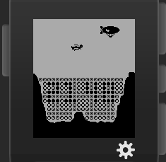

# ravine-despoiler
Ravine Despoiler watchface for Pebble

This is an homage to the 1977 Atari arcade game
[Canyon Bomber](http://www.mobygames.com/game/canyon-bomber), reimagined
as a Pebble watchface.  A zeppelin and biplane fly over the ravine, occasionally
dropping bombs that destroy the boulders below.  THe time is constantly displayed
in inverted boulders that are never destroyed.  Each minute, the ravine is
regenerated and the cycle continues.

This code is released under the open source MIT Licence.  See LICENSE for details.